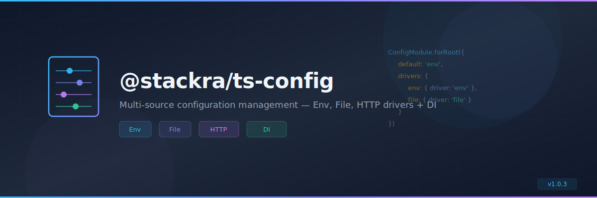

<p align="center">
  
</p>

<p align="center">
  <a href="https://www.npmjs.com/package/@stackra/ts-config">
    
  </a>
  <a href="./LICENSE">
    
  </a>
  <a href="https://www.typescriptlang.org/">
    
  </a>
</p>

---

# @stackra/config

NestJS-inspired configuration management with multiple drivers (Env, File,
Firebase) for Refine applications.

## Features

- 🔧 Multiple drivers: Environment variables, File-based, Firebase
- 🎯 Type-safe getters: `getString()`, `getNumber()`, `getBool()`, etc.
- 🌍 Environment helper: `Env.get()`, `Env.getBool()`, etc.
- 📁 File pattern scanning for config files
- 🔄 Variable expansion support
- 💾 Built-in caching
- 🎨 Laravel and NestJS inspired API

## Installation

```bash
npm install @stackra/config
# or
pnpm add @stackra/config
```

## Quick Start

### 1. Using Environment Variables (Default)

```typescript
import { Module } from '@stackra/container';
import { ConfigModule, ConfigService } from '@stackra/config';

@Module({
  imports: [
    ConfigModule.forRoot({
      envFilePath: '.env',
      isGlobal: true,
    }),
  ],
})
export class AppModule {}

// Use in your services
@Injectable()
export class DatabaseService {
  constructor(private config: ConfigService) {}

  getConnection() {
    return {
      host: this.config.getString('DB_HOST', 'localhost'),
      port: this.config.getNumber('DB_PORT', 5432),
      ssl: this.config.getBool('DB_SSL', false),
    };
  }
}
```

### 2. Using File-Based Configuration

```typescript
@Module({
  imports: [
    ConfigModule.forRoot({
      driver: 'file',
      filePattern: 'config/**/*.config.ts',
      isGlobal: true,
    }),
  ],
})
export class AppModule {}
```

Create config files:

```typescript
// config/database.config.ts
export default {
  host: process.env.DB_HOST || 'localhost',
  port: parseInt(process.env.DB_PORT || '5432'),
  database: process.env.DB_NAME || 'myapp',
};

// config/cache.config.ts
export default {
  driver: process.env.CACHE_DRIVER || 'memory',
  ttl: 300,
};
```

Access in your code:

```typescript
const dbHost = this.config.get('database.host');
const cacheDriver = this.config.get('cache.driver');
```

## ConfigService API

### Type-Safe Getters

```typescript
// Get string
config.getString('APP_NAME', 'MyApp');
config.getStringOrThrow('APP_NAME');

// Get number
config.getNumber('PORT', 3000);
config.getNumberOrThrow('PORT');

// Get boolean
config.getBool('DEBUG', false);
config.getBoolOrThrow('DEBUG');

// Get array (comma-separated)
config.getArray('ALLOWED_HOSTS', ['localhost']);

// Get JSON
config.getJson<MyType>('COMPLEX_CONFIG', defaultValue);

// Generic get
config.get<string>('KEY', 'default');
config.getOrThrow<string>('KEY');

// Check existence
config.has('KEY');

// Get all
config.all();
```

## Env Helper

Use the `Env` helper for direct environment variable access:

```typescript
import { Env } from '@stackra/config';

// Get string
const appName = Env.get('APP_NAME', 'MyApp');
const apiKey = Env.getOrThrow('API_KEY');

// Get number
const port = Env.getNumber('PORT', 3000);

// Get boolean
const debug = Env.getBool('DEBUG', false);

// Get array
const hosts = Env.getArray('ALLOWED_HOSTS', ['localhost']);

// Get JSON
const config = Env.getJson<MyConfig>('APP_CONFIG');

// Check existence
if (Env.has('FEATURE_FLAG')) {
  // ...
}

// Get all
const allEnv = Env.all();
```

## Configuration Options

```typescript
interface ConfigModuleOptions {
  // Driver type
  driver?: 'env' | 'file' | 'firebase';

  // Env driver options
  envFilePath?: string | string[];
  ignoreEnvFile?: boolean;
  expandVariables?: boolean;

  // File driver options
  filePattern?: string | string[];

  // Custom configuration
  load?: Record<string, any> | (() => Record<string, any>);

  // Module options
  isGlobal?: boolean;
  cache?: boolean;
  validate?: (config: Record<string, any>) => void;
}
```

## Examples

### Environment Variables with Expansion

```typescript
ConfigModule.forRoot({
  envFilePath: '.env',
  expandVariables: true, // Enables ${VAR} expansion
});
```

```.env
BASE_URL=https://api.example.com
API_ENDPOINT=${BASE_URL}/v1
```

### Multiple Environment Files

```typescript
ConfigModule.forRoot({
  envFilePath: ['.env', `.env.${process.env.NODE_ENV}`],
});
```

### Custom Configuration

```typescript
ConfigModule.forRoot({
  load: {
    app: {
      name: 'MyApp',
      version: '1.0.0',
    },
  },
});
```

### Validation

```typescript
ConfigModule.forRoot({
  validate: (config) => {
    if (!config.DATABASE_URL) {
      throw new Error('DATABASE_URL is required');
    }
  },
});
```

## Comparison with Other Packages

### vs @stackra/cache and @stackra/logger

All three packages follow the same pattern:

```typescript
// Cache
import cacheConfig from '@stackra/cache/config/cache.config';
CacheModule.forRoot(cacheConfig);

// Logger
import loggerConfig from '@stackra/logger/config/logger.config';
LoggerModule.forRoot(loggerConfig);

// Config (manages both!)
import { ConfigModule, ConfigService } from '@stackra/config';
ConfigModule.forRoot({ isGlobal: true });

// Now use ConfigService to get cache/logger settings
const cacheDriver = config.getString('CACHE_DRIVER', 'memory');
const logLevel = config.getString('LOG_LEVEL', 'debug');
```

## License

MIT
